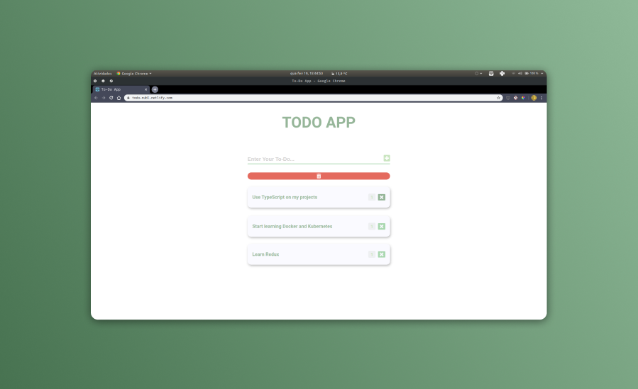

# To-Do Application



This is a very simple to-do application made with React and Redux to train some knowledge in State management.
It allows the creation and removal of to-dos, including the possibility to delete all to-dos at once.
Because it is such a simple application, I could have done it using only React's Context API.

You can also see the Design of the application [here](https://www.figma.com/file/5lqv2bMpmNIwg9OIrQFU1u/Todo-App).

## Getting Started

These instructions will get you a copy of the project up and running on your local machine for development and testing purposes. Feel free to deploy if you want.

### Installation

Clone the repository and run

```javascript
// With Yarn
$ yarn install
$ yarn start
```

## Built With

-   [ReactJS](https://reactjs.org/)
-   [Redux](https://redux.js.org/)
-   [Styled Components](https://styled-components.com/)

## Contributing

Please feel free to send pull request if you want to contribute!

## Authors

-Nubelson - _Development_ - [nubelsondev](https://github.com/nubelsondev)
